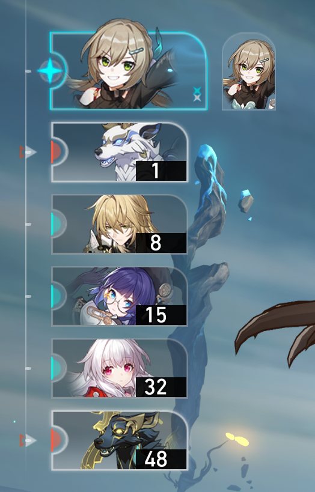
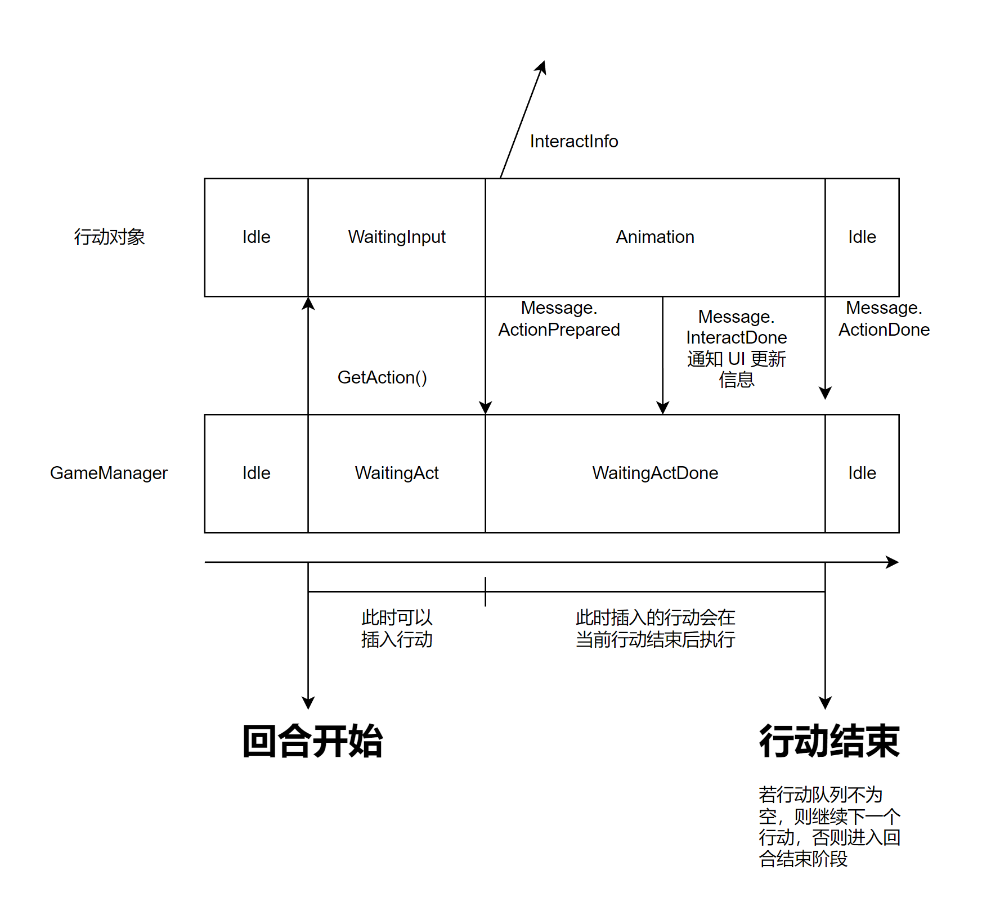

# 《崩坏：星穹铁道》战斗机制重建项目文档

本文档旨在说明本项目的概况与项目中各目录、文件的结构和作用。

## 1. 项目概况

本项目 (以下简称 StarSim) 旨在分析与重建游戏《崩坏：星穹铁道》(以下简称《崩铁》) 中的回合制战斗机制，项目重点在于机制的实现，
因此在数值、动画、特效、UI 方面将显得较为简陋。

《崩铁》的战斗机制是以速度为基础的回合制机制，辅以战斗属性、弱点击破、行动插队等机制，配合各个角色各有不同的机制，
和设计独特的怪物，形成了具有多样性的战斗机制。

## 2. 战斗系统拆解

《崩铁》的战斗系统主要可以分为以下 3 个部分
1. 行动系统
2. 交互系统
3. 事件系统

其中**交互系统**指参加战斗的游戏对象之间的交互，可以细分为
1. 伤害系统
2. Buff 系统

本章剩余内容将详细介绍这几个系统

### 2.1 行动系统

#### 2.1.1 机制介绍
《崩铁》的战斗中，所有参与战斗的对象依照**行动值**依次行动，所有对象都具有两个属性：
1. 速度
2. 距离

其中<u>速度</u>是对象的一个固有属性，由对象本身数值、装备数值和当前持有的 Buff 决定，
而<u>距离</u>则是一个进入战斗后才获得的实时属性，在战斗开始时，所有目标的距离 (默认) 将被设定为 10000.

而具体的行动机制则可以比喻成所有角色都在一条长度为 10000 米的环形跑道上运动，速度的单位则被认为是**米每秒**，
当一个角色跑完了 10000 米而又回到起点时，就进入该角色的<u>回合</u>。
由此，<u>行动值</u>可由以下这个简单的公式计算：行动值 = 距离 / 速度。也就是说，行动值就是角色距离下一个回合
所需的时间。当跑到终点的角色行动完之后，他又会从起点出发，进入下一圈。

由于是回合制的战斗，我们可以认为角色在进行行动时的时间是停滞的，也就是所有对象都需要暂停其前进，等到行动中
的角色行动结束，才会继续在这个 10000 米的跑道上前进，直到进入下一个对象的回合。

此外，在《崩铁》中，<u>回合</u>与<u>行动</u>是两个不同的概念，回合就如上文所描述的，当一个角色的行动值
达到 0 时，进入其<u>回合</u>，而<u>行动</u>则是对象进行一次动作的最小粒度，一个回合中可以包含多个行动，
当其中所有的行动都结束后，该回合才结束。



如上图，可以认为纵向排列的是各对象的回合，而横向排列的是各对象的行动，一个回合内可以有多个行动。

一般来说，每个回合中至少包含一个当前回合所有者的行动，称之为<u>主要行动</u>，对象可以在该行动中释放其技能 
(对于玩家操控的角色来说则是普通攻击或战技)，如果没有其他行动的加入，在主要行动结束后将会进入回合结束阶段。
与主要行动相对的则是<u>额外行动</u>和<u>追加行动</u>，这两种行动都在满足某些条件后产生，其区别 (我认为) 
仅在于是否需要玩家输入，如各角色的终结技则是一种最典型的额外行动，其在角色能量充满且玩家按下对应按键时生成，
并插入到当前回合中，然后等待玩家输入。而角色”克拉拉“的反击则是一种典型的追加行动，其在角色受到攻击时自动产生
并插入到当前回合中，并且不需要玩家输入，自动执行。

在本项目中，回合和行动的管理由 GameManager (以下简称 GM) 负责，
在战斗开始时，GM 会将所有参与战斗的游戏对象加入到一个优先队列中，称为**回合队列**，
回合队列中的对象根据其行动值排列，每次取出行动值最小的角色，进入其回合，并使整个行动序列
推进至该角色行动值为 0 的时间点，即将所有对象的行动值减去该角色的行动值。

此处需要注意的是，根据游戏中的机制，仅当角色的主要行动结束后，才会将其距离重置并重新计算行动值后
放入行动序列中，因此，进入一个角色的回合是，我们先使用队列的 Top 方法获取角色信息但不出队，直到当其主行动
结束后，再将其入队并根据行动值更新其在队列中的位置。

一个回合可以被分为以下阶段：

1. 回合开始阶段
2. (可选) 额外行动阶段
3. 主要行动阶段
4. (可选) 额外行动阶段
5. 回合结束阶段

进入回合后，GM 会生成该角色的主要行动，并放入**行动队列**中，行动队列中的行动根据其**优先级**排序，
优先级高的行动先执行，当一个新的行动加入到行动队列中时，会根据其优先级将其插入到合适的位置。
有些行动具有**不可插队**的属性 (如希儿的额外行动)。

在回合开始阶段后，GM 会使用队列的 Top 方法取出行动队列中的第一个行动 (通常是主要行动)，并通知游戏对象执行行动
若游戏对象是敌方对象，则会立刻自动执行其行动，正因此敌方的回合不存在第一个可选的额外行动阶段。若游戏对象是玩家操控的角色，
则会等待玩家输入，此时玩家可以选择插入其他行动 (一般是终结技或战斗场地赋予的特殊技能 (R))，若插入的行动优先级
比等待中的行动优先级高，则会将等待中的行动打断，并转向执行插入的行动。

需要等待玩家输入的行动会在获得玩家的确认性质输入后，才会从行动队列中 Pop 出来，进入真正的执行。在执行的过程(动画)中，
若有新的行动插入，则会放在行动序列中，等到当前行动执行完毕后才执行。

当一个行动结束后，GM 会检查行动队列中是否有剩余的等待执行的行动，若有则继续执行，若没有则进入回合结束阶段。

#### 2.1.2 项目中的实现


上图体现了一个回合的最小结构，其中仅包含一个主要行动。

该部分将会涉及以下类：
1. ```GameManager```：负责回合和行动的管理类，单例。
2. ```BaseObject, Friendly, Enemy```：```BaseObject```是游戏对象的基类，```Friendly```和```Enemy```分别是玩家操控的角色和敌方角色的基类
3. ```Action```：包含一次行动的信息，包括其所有者、优先级等信息。
4. ```InteractManager```：负责游戏对象之间的交互，包括伤害、Buff 等。
5. ```ActionDetail```：包含一次行动的具体信息，包括行动的类型、目标、伤害等信息, 这些信息由 ```InteractManager``` 处理。

下面将详细介绍战斗开始后一个回合的流程。

1. 在上个回合结束后，会调用 GM 的 ```NextTurn``` 方法，进入下一个回合

在 ```NextTurn``` 方法中，GM 将执行
```_turnQ.Top()``` 以取出回合队列中的第一个对象，也就是当前回合的所有者，并调用 ```Action``` 类的构造函数
生成一个该对象的主要行动，并将其加入行动队列 ```_actionQ``` 中，然后执行 ```NextAction``` 方法。

2. 在 ```NextAction``` 方法中，GM 将执行 ```_actionQ.Top()``` 以取出行动队列中的第一个行动，并从中得到行动者的信息
然后调用行动者 (```BaseObject```) 的 ```GetAction``` 方法，并将自身状态置为 `WaitingAct`。

3. 在 ```GetAction``` 方法中，行动者将会根据 `Action` 中的信息，确定本次行动是否需要输入，若需要输入，则设置当前行动状态
后返回，等待玩家输入，若不需要输入，则根据行动中的信息执行对应的逻辑。

在这些逻辑中，可能包含新的行动的生成和插入，或是如果玩家输入了终结技的操作
，此时需要调用 `GameManager` 的 `RequireExtraAction` 方法，
该方法的参数是一个 `Action` 对象，GM 会将其加入到行动队列中，
若此时 GM 的状态是 `WaitingAct`，即等待玩家输入状态，则会判断新的行动是否插入到了行动序列的顶端，
若是，则会终止当前的行动，向行动者发送 "Message.ActionInterrupted" 消息，行动者接收到该消息后会终止当前行动，
即将各种状态重置。然后 GM 调用 `NextAction` 方法转向新的行动的执行。

4. 当行动者接收到玩家的确认性质的输入后，将会向 GM 发送 `Message.ActionPrepared` 消息，表示该行动已经准备好，
即将进入执行状态，GM 在收到该消息后将自身状态置为 `WaitingActDone`，表示此时插入的行动将不能立刻执行，并将当前行动
真正从 `_actionQ` 中移除。
然后行动者将根据玩家输入以及自身属性生成 `ActionDetail` 对象，其中包含了本次行动的所有数据，包括行动类型、
目标、目标类型、伤害倍率、Buff 等，然后将该对象发送给 `InteractManager`，由 `InteractManager` 处理其中信息并
转发给目标对象。

5. 然后行动者将会进入行动的动画，当动画执行到与目标完成交互 (比如攻击动画结束，进入返回状态) 时，将会向 GM 发送
`Message.InteractDone` 消息，表示已经完成与目标的交互，可以在 UI 上显示伤害、Buff 等信息。

6. 当行动者动画结束，回到原位后，将会向 GM 发送 `Message.ActionDone` 消息，表示本次行动已经完成，GM 在收到该消息后将会
调用 `ActionDone` 方法，该方法首先检查当前完成的行动是否为主要行动，若是主要行动，则将行动者从回合队列中移除，并重置其
行动值后重新加入回合队列中。
之后将会检查行动队列中是否还有等待执行的行动，若有，则调用 `NextAction` 方法，否则调用 `TurnEnd` 方法，进入下一个回合。

7. 在 `TurnEnd` 方法中，GM 将会通知当前回合所有者执行回合结束阶段逻辑，然后调用 `NextTurn` 方法，进入下一个回合。


# 3 各文件、类的详细说明

# 3.1 GameManager
GameManager 是负责管理回合和行动的类，持有所有参与战斗的对象的引用，因此其同时负责目标选择等系统

## 3.1.1 方法

---
以下为关于战斗流程的方法
1. `Initialize()`：初始化方法, 其中初始化各属性, 以及给所有对象分配实时 ID 和附加于该对象上的目标选择光标
2. `BattleInit()`: 战斗初始化, 将所有对象加入 `_turnQ` 中, 然后调用 `NextTurn()` 进入下一回合
3. `NextTurn()`: 进入下一回合, 通过 `_turnQ.Top()` 取出下一个回合所有者, 生成其主要行动, 并加入 `_actionQ` 中, 然后调用 `NextAction()` 进入下一行动
4. `NextAction()`: 进入下一行动, 通过 `_actionQ.Top()` 取出下一个行动, 并调用其所有者的 `GetAction()` 方法, 然后将自身状态置为 `WaitingAct`, 如果该行动需要玩家输入和指定目标, 则将启用目标选择器.
5. `ActionCancel()`: 用于某些特殊情况下的回合取消, 将当前行动通过 `actionQ.Pop()` 取出并直接进入 `ActionDone()` 方法.
6. `InteractDone()`: 用于在交互完成时更新 UI 信息.
7. `ActionDone()`: 用于在行动完成时更新 UI 信息, 并检查是否是主要行动结束, 并检查是否有等待执行的行动, 若有则调用 `NextAction()` 方法, 否则调用 `TurnEnd()` 方法.
8. `TurnEnd()`: 用于在回合结束时通知当前回合所有者进入回合结束阶段, 然后调用 `NextTurn()` 方法.
---
以下为关于游戏对象, UI之间的通信的方法
1. `GetInputFromUI(KeyCode input)`: 用于从 UI 获取输入并转发给当前行动对象, 或是尝试执行输入的终结技.
2. `GetInputFromUI(InputMessage msg)`: 用于从 UI 获取战斗开始等相关输入信息.
3. `GetRandomObject(bool enemy)`: 获取一个随机目标对象, 用于某些需要随机目标的行动.
4. `GetMessageFromActor(Message msg)`: 用于从游戏对象获取消息, 如行动准备完成, 交互完成等. 在上文中有所介绍.
5. `RequireExtraAction(Action action)`: 用于在回合中插入新的行动, 该方法会将新的行动加入 `_actionQ` 中, 并检查是否需要打断当前行动.
6. `GetActQ()`, `GetTurnQ()`, `GetActorName()`: 用于获取行动队列, 回合队列, 当前行动对象的名称, 用于 UI 显示
---
以下为 Private 方法
1. `TryFriendlyUltimate(int pos)`: 用于在接收到 UI 的终结技按键输入后,将其转发给对应的对象, 对象收到后会检查是否可以释放终结技, 若可以则生成终结技行动, 并调用 `RequireExtraAction()` 方法.
2. `EventUpdateTurnQ(BaseObject sender, BaseObject _)`: 用于在接收到对象的行动值更新事件后, 更新其在回合队列中的位置.
---
以下为目标选择器相关方法
1. `TryMoveCursor(KeyCode k)`: 用于在接收到 UI 的输入后, 通知目标选择器尝试移动目标指示器.
2. `SetCursorForm(TargetForm targetForm, TargetSide targetSide)`: 用于设置目标选择器的目标形式和目标阵营.
3. `MoveCursorTo(BaseObject obj)`: 用于将目标选择器移动到指定对象上.
4. `TargetLock(BaseObject obj)`: 用于将目标选择器锁定到指定对象上, 并禁止移动直到下一次调用 `SetTargetForm()` 方法.


# 3.2 TargetSelector
TargetSelector 是目标选择器类, 用于在需要玩家输入目标的行动中, 选择目标对象, 控制目标指示器的显示和移动.


。
。